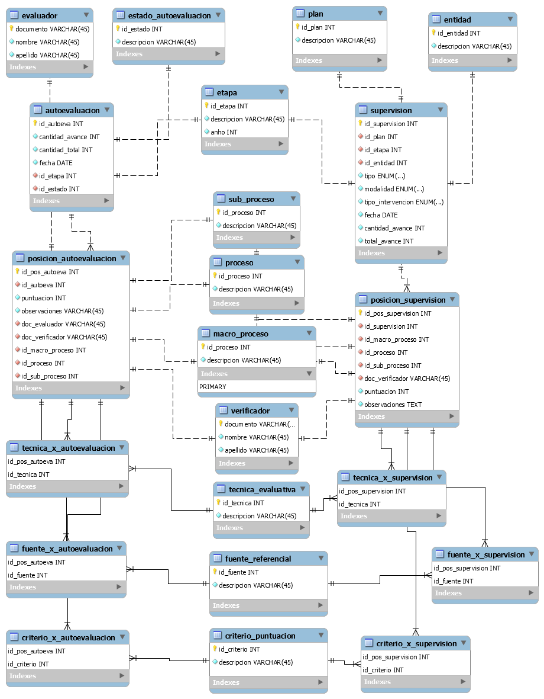

# API REST SuSalud

API REST (parcial) de dos procesos del documento SuSalud.\
Parcial 3 | Sistemas Transaccionales | Uniminuto 2021

Herramientas
---------------
- Spring Boot
- Spring Data JPA
- MySQL Workbench
- MariaDB
- Java 11
- Postman

### Información del servidor
- Para iniciar el servidor se debe ejecutar <pre>./gradlew bootRun</pre>
- URL local de vista inicial _(Solo aplica cuando el servidor está iniciado de forma local)_ <pre>http://localhost:9090/api/</pre>
- Para cambiar los datos de conexión a la base de datos, se debe modificar el archivo [application.properties](./src/main/resources/application.properties)

### Infomación de base de datos
- Se debe crear una base de datos llamada <pre>susalud</pre>
- El diagrama del modelo relacional [SuSalud.mwb](docs/db/SuSalud.mwb) fue creado con **MySQL Workbench**.
- El archivo [initQueries.sql](docs/db/initQueries.sql) contiene el llenado alternativo de las tablas de la base de datos. 
- [Collection](./docs/SuSalud.postman_collection.json) que se debe **importar en Postman** para probar la API REST.

### Diagrama del modelo relacional

## Licencia
Este proyecto cuenta con [licencia](LICENSE) conforme a los términos de la licencia GNU General Public License v3.0
