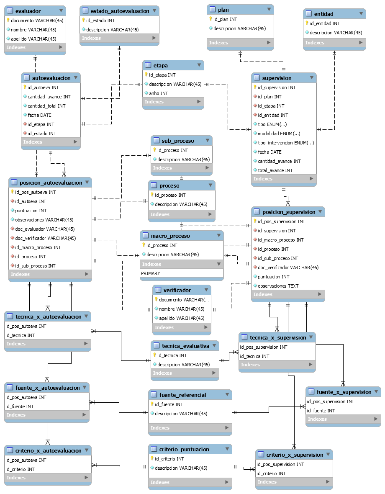

# API REST SuSalud

API REST (parcial) de dos procesos del documento SuSalud.

Herramientas
---------------
- Spring Boot
- Spring Data JPA
- MySQL Workbench
- MariaDB
- Java 11

## Recursos de base de datos

### Información necesaria
- Se debe crear una base de datos llamada <pre>susalud</pre>
- El diagrama del modelo relacional [SuSalud.mwb](./db/SuSalud.mwb) fue creado con **MySQL Workbench**
- El archivo [initQueries.sql](./db/initQueries.sql) contiene el llenado alternativo de las tablas de la base de datos.

### Diagrama del modelo relacional

## Licencia
Este proyecto cuenta con [licencia](LICENSE) conforme a los términos de la licencia GNU General Public License v3.0
